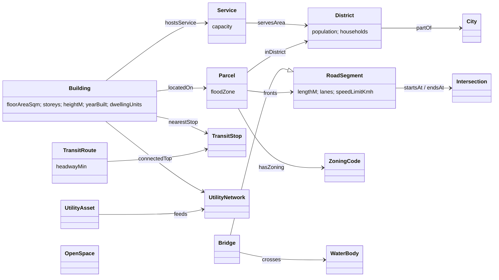

# Small City Semantic Model

A semantic (RDF/OWL) model of a small city (roughly 1,000 to 20,000 residents), with a full example: **Millbrook**, a made-up river town of 4,800 people.

The model describes what the city contains: districts, parcels, buildings, roads, services, utilities and green/blue space. It also describes how these relate: containment, adjacency, network connectivity, who serves whom, and zoning. Everything is a standard RDF graph, so it can be queried with SPARQL, checked with SHACL and extended with more OWL classes.

## Files

| File | Purpose |
|---|---|
| `ontology.ttl` | **TBox**: classes and properties (`sc:` namespace). Spatial classes extend GeoSPARQL `geo:Feature`. |
| `millbrook.ttl` | **ABox**: the Millbrook instance data with WKT geometry (CRS84). |
| `shapes.ttl` | **SHACL** integrity rules (required geometry, zoning compatibility, road graph shape, …). |
| `queries/*.rq` | Example SPARQL analyses. |
| `validate.py` | Loads the graph, runs SHACL validation and every query. |

```bash
pip install rdflib pyshacl
python semantic_model/validate.py
```

## Conceptual model



### Class hierarchy

```
geo:Feature
└── sc:CityElement
    ├── sc:City
    ├── sc:District
    ├── sc:Parcel
    ├── sc:Building
    │   ├── ResidentialBuilding   (disjoint with IndustrialBuilding)
    │   ├── CommercialBuilding
    │   ├── IndustrialBuilding
    │   ├── CivicBuilding
    │   └── MixedUseBuilding
    ├── sc:TransportElement
    │   ├── RoadSegment ── Bridge
    │   ├── Intersection
    │   └── TransitStop
    ├── sc:UtilityAsset
    │   ├── Substation
    │   ├── WaterTreatmentPlant
    │   └── WaterTower
    ├── sc:OpenSpace ── Park, Plaza
    └── sc:WaterBody ── River

sc:Service          (non-spatial; hosted by a Building)
├── EducationService, HealthService, GovernmentService, CulturalService, RetailService
└── EmergencyService ── FireService, PoliceService

sc:TransitRoute, sc:UtilityNetwork (PowerNetwork, WaterNetwork)
sc:ZoningCode  individuals: R1, R2, C1, MU, I1, P, OS
sc:RoadClass   individuals: Arterial, Collector, Local
```

### Main design choices

- **Function is separate from form.** A `Building` is a physical object. A `Service` is what happens inside it. The Town Hall therefore hosts both town administration and the police desk, and a service could move to another building without changing either building's class.
- **Containment is transitive.** `locatedOn` and `inDistrict` are sub-properties of the transitive `sc:partOf`, so a reasoner can infer Building → Parcel → District → City.
- **Roads form a graph.** `RoadSegment`s are edges, linked to `Intersection` nodes with `startsAt`/`endsAt`. The symmetric `connectsTo` stores node adjacency directly, so connectivity can be checked with SPARQL property paths.
- **Geometry follows GeoSPARQL.** Each feature has `geo:hasGeometry/geo:asWKT`. A GeoSPARQL-capable store (GraphDB, Jena Fuseki + GeoSPARQL, Stardog) can run `geof:sfIntersects`, `geof:distance` and similar functions on it directly.
- **Rules live in SHACL, not in the ontology.** OWL describes what can exist. SHACL states what correct data must look like, for example a residential building only on R-1, R-2 or MU land, or 1–8 storeys.

## Millbrook at a glance

```
    lat 41.705 ┌──────────┬──────────┬─┬────────┐
               │ Northside│ Old Town │R│Eastbank│
    lat 41.700 ├──Main St─┼──────────┤i├─(bridge)
               │ Southgate│ Riverside│v│        │
    lat 41.695 └──────────┴──────────┴─┴────────┘
           -73.910     -73.904    -73.898  -73.894
                   Market St    River Rd  Mill Ln
```

| District | Population | Character | Key elements |
|---|---|---|---|
| Northside | 1,800 | Residential (R-1/R-2) | Oak Terrace Apartments, Northside Homes, water tower |
| Old Town | 900 | Town centre (C-1/MU/P) | Town Hall (+ police), library, clinic, grocery, Main St mixed-use block, Market Square |
| Southgate | 1,700 | Residential | Millbrook Elementary, Fire Station 1, Southgate Cottages |
| Riverside | 300 | Park + heritage industry | Riverside Park, Old Mill Workshops (flood zone) |
| Eastbank | 100 | Utilities / light industry | Water treatment plant, substation, warehouse (flood zone) |

- **Roads:** 9 intersections and 8 segments. Main Street (arterial) runs east–west and crosses the Mill River on **Mill Bridge**. Market Street (collector) runs north–south. River Road and Mill Lane are local roads.
- **Transit:** Route 1 Town Loop, every 30 min, with 4 stops. Each building links to its nearest stop.
- **Utilities:** the Eastbank Substation feeds the power grid. The treatment plant and the Northside water tower feed the water supply. Every building connects to both networks.

Model size: about 950 triples.

## Example questions the model answers

| Query | Question | Result on Millbrook |
|---|---|---|
| `01_population_by_district` | Where do people live? | Northside and Southgate hold 73% of residents |
| `02_services_by_district` | Where are public services located? | All services except school and fire are in Old Town |
| `03_flood_exposure` | Which buildings are in the flood zone? | Old Mill Workshops (1871) and Eastbank Warehouse |
| `04_reachable_intersections` | Is the road network connected? | All 8 other intersections are reachable from Main & Market |
| `05_single_points_of_failure` | Which areas depend on one bridge? | Eastbank, including all water and power assets, is reached only via Mill Bridge |
| `06_school_capacity` | Is the school large enough? | 320 places against about 384 estimated pupils, so the school is short of places |

These results come straight from the data. They show the kind of planning insight a semantic model makes easy: the town's critical utilities sit behind a single bridge, and the elementary school is over capacity.

## Extending the model

- **More detail:** add `sc:Floor` / `sc:Unit` under `Building`, or connect to CityGML / IFC through `owl:equivalentClass`.
- **Time:** add `sc:validFrom` / `sc:validTo`, or use OWL-Time, to model planned developments and demolitions.
- **Sensors / digital twin:** attach SOSA/SSN `sosa:Sensor` and observations to buildings and road segments (traffic counts, energy use).
- **Real data:** map OpenStreetMap tags (`building=*`, `highway=*`, `amenity=*`) to `sc:` classes, then replace the WKT boxes with real footprints.
